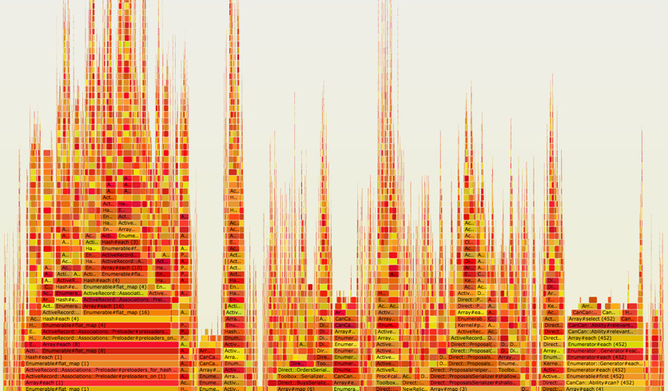

# Flameboyant

Generate an interactive SVG flame chart.



## Thanks
- https://github.com/oozou/ruby-prof-flamegraph
- https://github.com/brendangregg/FlameGraph

## Usage

### Example basic ruby
```ruby
Flameboyant.profile(name: 'foo', width: 1024) do
  # interesting code here
end
```

Files are written to current directory.

### Example Rails Console

```ruby
Flameboyant.profile do
  app.get '/interesting/api/call'
end
```

## `profile` Options
+ name (String, optional) :: The output file will be prefixed with this name.
+ width (Integer, optional) :: defaults to 1920.

When running under Rails, SVG files are written to `Rails.root/tmp/flames`

## Installation

Add this line to your application's Gemfile:

```ruby
gem 'flameboyant'
```

And then execute:

    $ bundle

Or install it yourself as:

    $ gem install flameboyant


## Development

After checking out the repo, run `bin/setup` to install dependencies. Then, run `rake spec` to run the tests. You can also run `bin/console` for an interactive prompt that will allow you to experiment.

To install this gem onto your local machine, run `bundle exec rake install`. To release a new version, update the version number in `version.rb`, and then run `bundle exec rake release`, which will create a git tag for the version, push git commits and tags, and push the `.gem` file to [rubygems.org](https://rubygems.org).

## Contributing

Bug reports and pull requests are welcome on GitHub at https://github.com/ddrscott/flameboyant.

## License

The gem is available as open source under the terms of the [MIT License](http://opensource.org/licenses/MIT).
